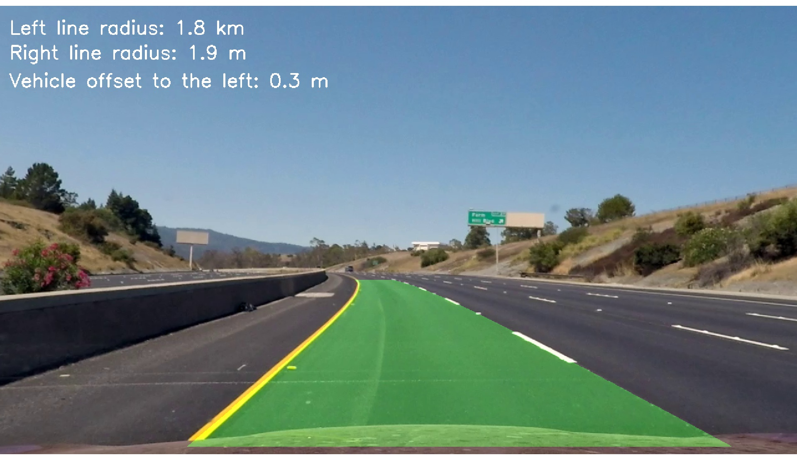

## Advanced Lane Finding

In this project, the goal was to write a software pipeline to identify the lane boundaries in a video, 
but the main output or product is to create a detailed writeup of the project.  

The Project
---

The pipeline steps in this simulation chain is implemented as following:

* Compute the camera calibration matrix and distortion coefficients given a set of chessboard images.
    * `camera_calibration.py`
* Apply a distortion correction to raw images.
    * `camera_calibration.py`
* Use color transforms, gradients, etc., to create a thresholded binary image.
    * `binary_image.py`
* Apply a perspective transform to rectify binary image ("birds-eye view").
    * `binary_image.py`
* Detect lane pixels and fit to find the lane boundary.
    * `curve_compuation.py`
* Determine the curvature of the lane and vehicle position with respect to center.
    * in `plot_func.py` as part of `annotate_frame` function
* Warp the detected lane boundaries back onto the original image.
    * in `plot_func.py` as part of `annotate_frame` function
* Output visual display of the lane boundaries and numerical estimation of lane curvature and vehicle position.
    * in `plot_func.py` as part of `annotate_frame` function
    
The processing chain starts in ``main.py`` that contains calls above mentioned pipeline steps.
The ``config.py`` contains configuration parameters that you could play with (set different thresholds, averaging interval, which algorithms to activate etc.).     

The images for camera calibration are stored in the folder called `camera_cal`. The images in `test_images` are for testing the pipeline on single frames. The video called project_video.mp4 is the video your pipeline should work well on.
Processed `test_images` stored in `output_images`. Processed videos stored in `output_videos` folder. 